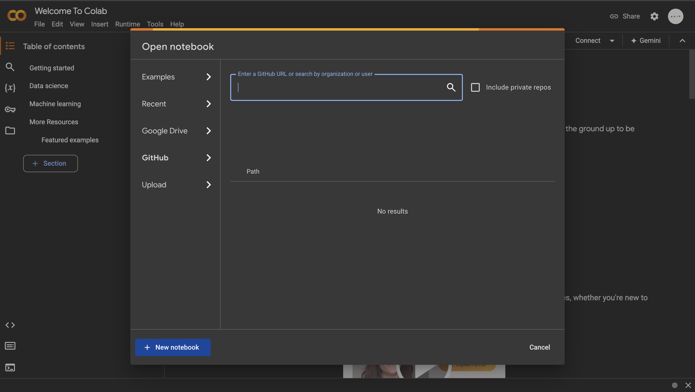
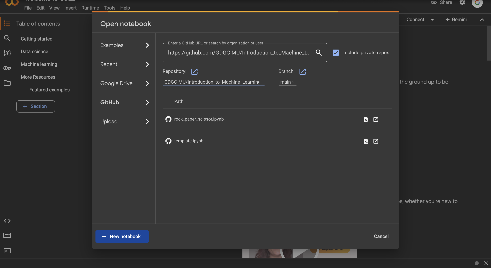
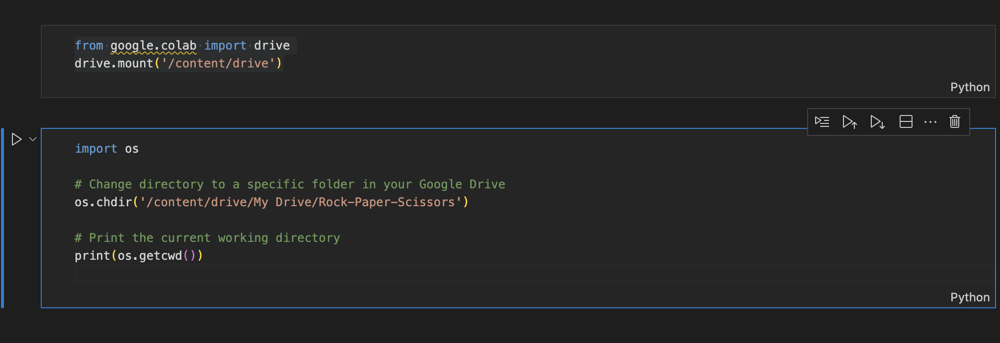

# Machine Learning with Tensorflow

## Table of Contents
- [Introduction](#introduction)
- [Installation](#installation)
  - [Step 1: Downloading Dataset](#step-1-downloading-dataset)
  - [Step 2: Uploading Datset to Google Drive](#step-2-uploading-dataset-to-google-drive)
  - [Step 3: Mounting Google Collab](#step-3-mounting-google-collab)
- [Setup Finalization](#setup-finalization)
- [Issues](#issues)
- [License](#license)

## Introduction
This guide provides instructions on setting up a machine learning environment with TensorFlow.


## Installation

### Step 1: Downloading Dataset

<p align="center">
  
</p>

You can download the Rock, Paper, Scissors dataset from Kaggle by following this [link](https://www.kaggle.com/datasets/sanikamal/rock-paper-scissors-dataset), which contains labeled images of hands playing the game, useful for building classification models.
g
### Step 2: Uploading Dataset to Google Drive

<p align="center">
  
</p>

To upload a dataset to Google Drive after unzipping it, follow these steps:

**Unzip the Dataset**:
   - Locate the zipped file on your computer.
   - Right-click on the file and select "Extract All" (Windows) or "Open" (Mac) to unzip it.
   - Choose a destination folder to extract the files.

**Upload to Google Drive**:
   - Open your web browser and go to [Google Drive](https://drive.google.com).
   - Sign in to your Google account if prompted.
   - In Google Drive, click on the "+ New" button on the left side.
   - Select "Folder Upload" if you want to upload an entire folder, or "File Upload" if you're uploading individual files.
   - Navigate to the folder where you extracted the dataset, select it, and click "Upload."

**Wait for the Upload to Complete**:
   - You’ll see a progress bar indicating the upload status. Wait until it's finished.
   - HEADS UP ! It might take a while!

**Check Your Files**:
   - After the upload is complete, you should see the dataset in your Google Drive. Should be a large dataset(rock-paper-scissors)!

That's it! Your dataset is now available in Google Drive for further use. If you have any questions or need help with a specific step, feel free to ask!

## Step 3: Mounting Google Collab


**Go to Google Colab**:
   - Click on link to redirect to google colab!
[Google Colab](https://colab.research.google.com/)

**Open book Option**:
   - A page looking like this should pop up! Go to the github option and copy this repository and paste it!

<p align="center">
  
</p>

   ```
    https://github.com/GDGC-MU/Introduction_to_Machine_Learning.git

   ```
<p align="center">
  
</p>

   - It should look like this and click on improvement.ipyb (in the photo it doesn't show yet)!

## Setup Finalization

   - Once in the notebook, make sure that this code is in your notebook.


<p align="center">
  
</p>

```python 
    from google.colab import drive
    drive.mount('/content/drive')
```

```python
    import os

    # Change directory to a specific folder in your Google Drive
    os.chdir('/content/drive/My Drive/Rock-Paper-Scissors')

    # Print the current working directory
    print(os.getcwd())
```
   - Run the program, make sure there is no issues. If there is issues make sure that the path matches how it looks in your google drive. 

## Issues

If you encounter any bugs or issues email: gdg@manhattan.edu or [Click Here](mailto:gdg@manhattan.edu)

Please provide as much detail as possible, including steps to reproduce the issue and we will try to help you out!

## License
MIT License

Copyright (c) [2024] [GDGCMU]

Permission is hereby granted, free of charge, to any person obtaining a copy
of this software and associated documentation files (the "Software"), to deal
in the Software without restriction, including without limitation the rights
to use, copy, modify, merge, publish, distribute, sublicense, and/or sell
copies of the Software, and to permit persons to whom the Software is
furnished to do so, subject to the following conditions:

The above copyright notice and this permission notice shall be included in all
copies or substantial portions of the Software.

THE SOFTWARE IS PROVIDED "AS IS", WITHOUT WARRANTY OF ANY KIND, EXPRESS OR
IMPLIED, INCLUDING BUT NOT LIMITED TO THE WARRANTIES OF MERCHANTABILITY,
FITNESS FOR A PARTICULAR PURPOSE AND NONINFRINGEMENT. IN NO EVENT SHALL THE
AUTHORS OR COPYRIGHT HOLDERS BE LIABLE FOR ANY CLAIM, DAMAGES OR OTHER
LIABILITY, WHETHER IN AN ACTION OF CONTRACT, TORT OR OTHERWISE, ARISING FROM,
OUT OF OR IN CONNECTION WITH THE SOFTWARE OR THE USE OR OTHER DEALINGS IN THE
SOFTWARE.
