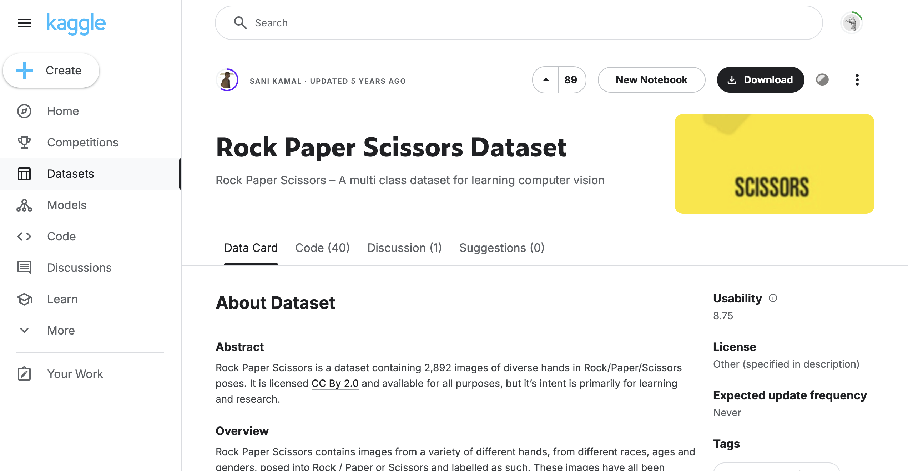
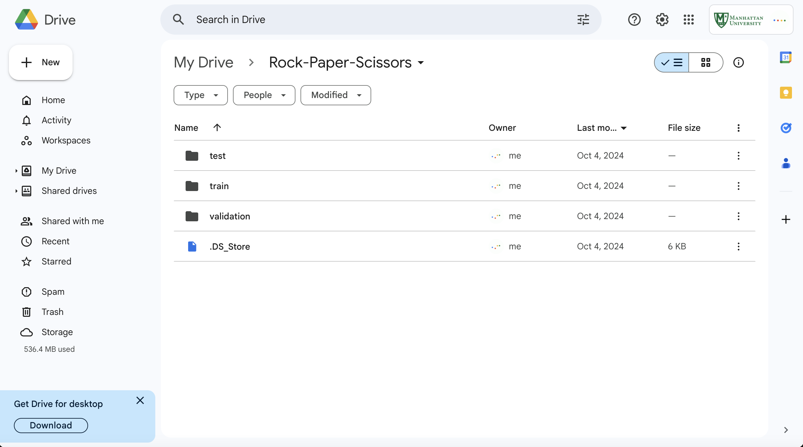

# Machine Learning with Tensorflow

## Table of Contents
- [Introduction](#introduction)
- [Installation](#installation)
  - [Step 1: Downloading Dataset](#step-1-downloading-dataset)
  - [Step 2: Uploading Datset to Google Drive](#step-2-uploading-dataset-to-google-drive)
  - [Step 3: Mounting Google Collab](#step-3-mounting-google-collab)
- [Verifying Installation](#verifying-installation)
- [License](#license)

## Introduction
This guide provides instructions on setting up a machine learning environment with TensorFlow.

## Installation

### Step 1: Downloading Dataset

  

You can download the Rock, Paper, Scissors dataset from Kaggle by following this [link](https://www.kaggle.com/datasets/sanikamal/rock-paper-scissors-dataset), which contains labeled images of hands playing the game, useful for building classification models.
g
### Step 2: Uploading Dataset to Google Drive

  

To upload a dataset to Google Drive after unzipping it, follow these steps:

**Unzip the Dataset**:
   - Locate the zipped file on your computer.
   - Right-click on the file and select "Extract All" (Windows) or "Open" (Mac) to unzip it.
   - Choose a destination folder to extract the files.

**Upload to Google Drive**:
   - Open your web browser and go to [Google Drive](https://drive.google.com).
   - Sign in to your Google account if prompted.
   - In Google Drive, click on the "+ New" button on the left side.
   - Select "Folder Upload" if you want to upload an entire folder, or "File Upload" if you're uploading individual files.
   - Navigate to the folder where you extracted the dataset, select it, and click "Upload."

3. **Wait for the Upload to Complete**:
   - You’ll see a progress bar indicating the upload status. Wait until it's finished.
   - HEADS UP ! It might take a while!

4. **Check Your Files**:
   - After the upload is complete, you should see the dataset in your Google Drive. Should be a large dataset(rock-paper-scissors)!

That's it! Your dataset is now available in Google Drive for further use. If you have any questions or need help with a specific step, feel free to ask!

### NEED FINISH 

## Step 3: Mounting Google Collab

### NEED FINISH

## Verify Installation

## Need FINISH

## Additional Resources

Helpful links and documentation to learn more about TensorFlow.

## License

This project is licensed under the MIT License.